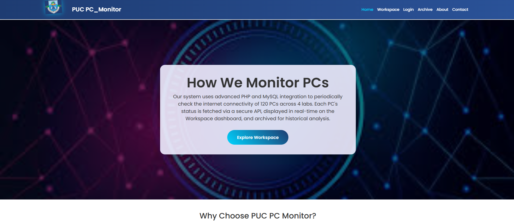
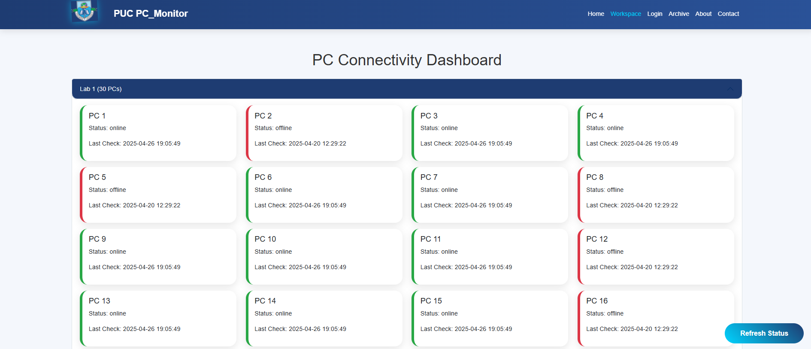
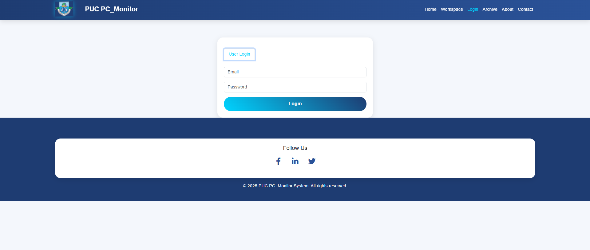
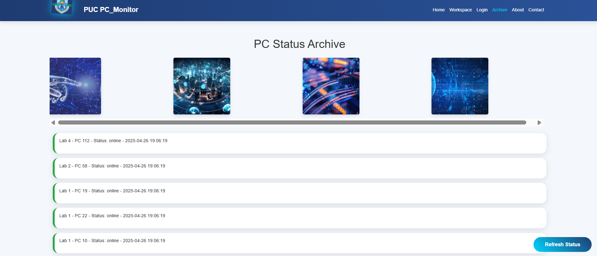
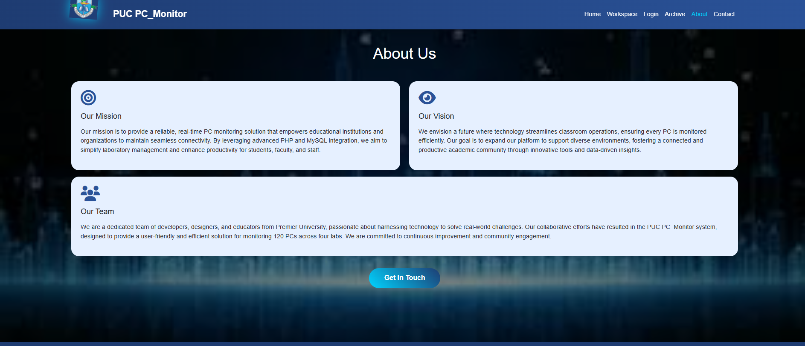
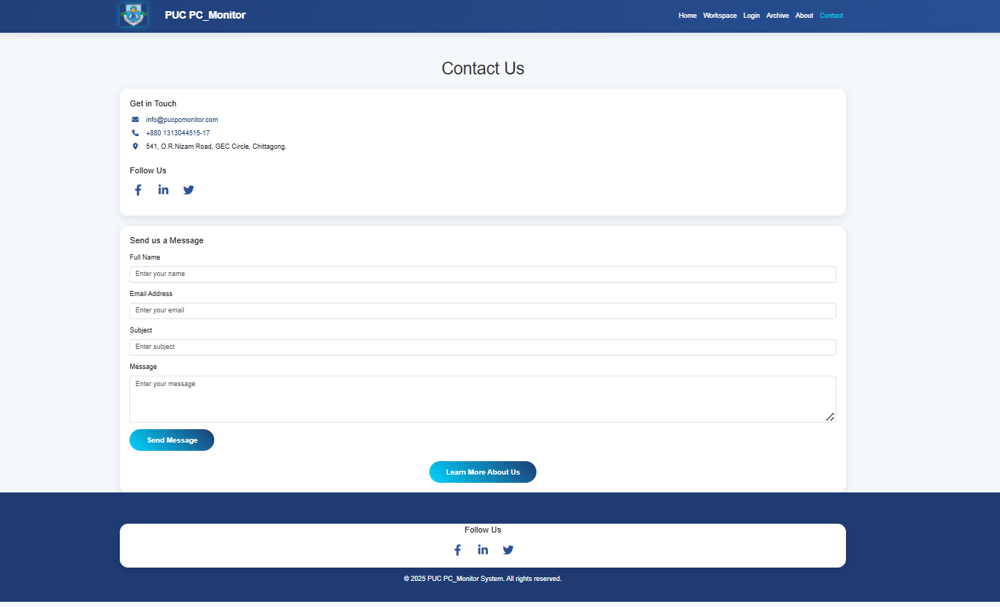

# 💻 PUC PC_Monitor System


> Real-time Internet Connectivity Monitoring System for Premier University, Chittagong – tracking the online/offline status of 120 lab PCs across 4 labs.

---

## 🚀 Live Demo

👉 [Live System](https://niloytalukdar.github.io/pcinternetcheckingsystem/)  

---

## 📸 Project Preview

### 🏠 Home Page


### 🧠 Workspace – Real-Time PC Status


### 🔐 Login & Register System


### 📂 Archive (Offline PC History)


### 🛠️ About Page


### 📞 Contact Page


---

## 🌟 Features

- ✅ Monitor PCs across 4 university labs
- 🔄 Real-time status update every 30 seconds
- 🔒 Secure Admin and User login system
- 🛠️ Admin can update PC status manually
- 📊 Archived offline PC records
- 📱 Fully responsive UI using Bootstrap 5
- 📬 Contact form for user support
- 🎨 Animated logo and smooth user experience

---

## 🛠️ Tech Stack

| Layer         | Technology                   |
|---------------|-------------------------------|
| Frontend      | HTML5, CSS3, Bootstrap 5, JavaScript |
| Backend       | PHP (PDO connection)           |
| Database      | MySQL                          |
| Extras        | Font Awesome, Google Fonts     |

---

## 📁 Folder Structure

```bash
puc-pc-monitor/
├── index.html
├── login.html
├── workspace.html
├── archive.html
├── about.html
├── contact.html
├── admin_dashboard.html
├── user_dashboard.html
│
├── style.css
├── script.js
│
├── config.php
├── login.php
├── archive.php
├── get_status.php
│
├── images/
│   ├── logopuc.png
│   ├── projectpic1.jpg
│   ├── premier_university_logo.png
│   ├── screenshot_home.png
│   ├── screenshot_workspace.png
│   ├── screenshot_login.png
│   ├── screenshot_archive.png
│   ├── screenshot_about.png
│   ├── screenshot_contact.png
```

---

## 📦 Getting Started

### 📌 Prerequisites
- Apache server (XAMPP, WAMP, etc.)
- PHP 7.x+
- MySQL server
- Web browser (Chrome, Firefox)

### 🧪 Installation

```bash
git clone https://github.com/your-username/puc-pc-monitor.git
cd puc-pc-monitor
```
- Move project folder into `htdocs/` (XAMPP users)
- Create a MySQL database and import `pc_monitoring.sql`
- Update your `config.php` file database settings:

```php
$host = "localhost";
$dbname = "pc_monitoring";
$username = "root";
$password = "";
```

- Start Apache & MySQL from XAMPP control panel
- Access the project at:  
  `http://localhost/puc-pc-monitor/`

---

## 🌍 Deployment

You can deploy your system online using:
- cPanel Hosting
- Hostinger
- InfinityFree
- Vercel (with PHP support)

---

## 🔐 License

This project is licensed under the [MIT License](LICENSE).

---

## 📬 Contact

- 📧 Email: [your-email@example.com](mailto:your-email@example.com)
- 🔗 LinkedIn: [https://linkedin.com/in/yourprofile](https://linkedin.com/in/yourprofile)

---

## 🙌 Acknowledgements

- Premier University, Chittagong
- Bootstrap 5 Documentation
- Stack Overflow Community
- Font Awesome Icons
- Google Fonts

---
